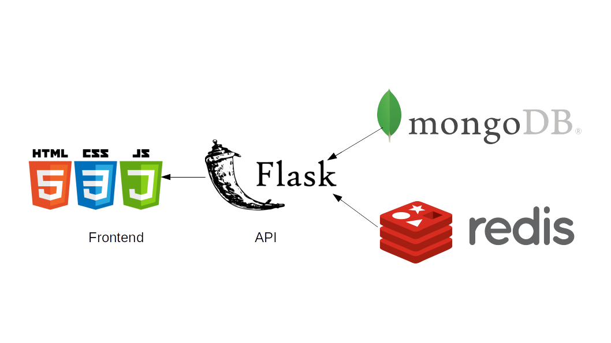

# TC3041 Proyecto  Final Primavera 2019

# *Aleph*
---

##### Integrantes:
1. *Mauricio Peón García*
2. *Romeo Varela Nagore*


---
## 1. Aspectos generales

### 1.1 Requerimientos técnicos

A continuación se mencionan los requerimientos técnicos mínimos del proyecto, favor de tenerlos presente para que cumpla con todos.

* El equipo tiene la libertad de elegir las tecnologías de desarrollo a utilizar en el proyecto, sin embargo, debe tener presente que la solución final se deberá ejecutar en una plataforma en la nube. Puede ser  [Google Cloud Platform](https://cloud.google.com/?hl=es), [Azure](https://azure.microsoft.com/en-us/) o AWS [AWS](https://aws.amazon.com/es/free/).
* El proyecto debe utilizar al menos dos modelos de bases de datos diferentes, de los estudiados en el curso.
* La solución debe utilizar una arquitectura de microservicios. Si no tiene conocimiento sobre este tema, le recomiendo la lectura [*Microservices*](https://martinfowler.com/articles/microservices.html) de [Martin Fowler](https://martinfowler.com).
* La arquitectura debe ser modular, escalable, con redundancia y alta disponibilidad.
* La arquitectura deberá estar separada claramente por capas (*frontend*, *backend*, *API RESTful*, datos y almacenamiento).
* Los diferentes componentes del proyecto (*frontend*, *backend*, *API RESTful*, bases de datos, entre otros) deberán ejecutarse sobre contenedores [Docker](https://www.docker.com/) y utilizar [Kubernetes](https://kubernetes.io/) como orquestador.
* Todo el código, *datasets* y la documentación del proyecto debe alojarse en un repositorio de GitHub siguiendo al estructura que aparece a continuación.

### 1.2 Estructura del repositorio
El proyecto debe seguir la siguiente estructura de carpetas:
```
- / 			        # Raíz de todo el proyecto
    - README.md			# Archivo con los datos del proyecto (este archivo)
    - app
        - frontend			# Carpeta con la solución del frontend (Web app)
        - backend			# Carpeta con la solución del backend (CMS)
        - datasets		        # Carpeta con los datasets y recursos utilizados (csv, json, audio, videos, entre otros)
        - dbs			# Carpeta con los modelos, catálogos y scripts necesarios para generar las bases de datos
        - modelos		           
```

### 1.3 Documentación  del proyecto

Como parte de la entrega final del proyecto, se debe incluir la siguiente información:

* Justificación de los modelo de *bases de datos* que seleccionaron.
* Descripción del o los *datasets* y las fuentes de información utilizadas.
* Guía de configuración, instalación y despliegue de la solución en la plataforma en la nube  seleccionada.
* Documentación de la API. Puede ver un ejemplo en [Swagger](https://swagger.io/).
* El código debe estar documentado siguiendo los estándares definidos para el lenguaje de programación seleccionado.

## 2. Descripción del proyecto

Este proyecto consta de una plataforma de libros en línea, en dónde cada usuario puede registrarse, iniciar sesión y agregar los libros que están leyendo.
El usuario tiene la seguridad de que su contraseña será hasheada para que nadie pueda verla, igualmente, la aplicación asegura que solo hay un nombre de usuario para cada cliente.


## 3. Solución

A continuación aparecen descritos los diferentes elementos que forman parte de la solución del proyecto.
Se utilizó lo siguiente:

    -Flask
    -MongoDB
    -Redis
    -Jinja2
    -HTML,CSS y JavaScript
Flask es un framework que permite la comunicación entre las bases de datos que estamos utilizando en la nube cómo lo son Atlas y RedisLabs.
Jinja hace posible la interacción entre el frontend y Flask.
HTML,CSS y JavaScript son los encargados de mostrar el frontend.
### 3.1 Modelos de *bases de datos* utilizados

En MongoDB utilizamos los siguientes modelos:

Libros

    {

        "_id":"string",
        "Autor":"string",
        "Titulo":"string",
        "Genero":"string",
        "Fecha_de_Publicacion": "DateTime",
        "Descripcion":"string",
        "numPaginas":"integer",
        "Editorial":"string",
        "Pais":"string",
        "Imagen":"string",
        "Libro":"string"
    }

Autores

    {

      "_id":"string",
      "Nombre":"string",
      "Apellido":"string",
      "Fecha_Nacimiento":"DateTime",
      "Nacionalidad":"string"

    }


Usuario

    {

       "_id":"string",
       "Nombre":"string",
       "Apellido":"string",
       "Correo":"string",
       "libros":["ObjectId"]

    }


Editorial

    {

       "_id":"ObjectId",
       "Nombre":"string"

    }


En Redis utilizamos el siguiente modelo:

    {
         "usuario":
         "password":
         "ttl":
    }

### 3.2 Arquitectura de la solución


### 3.3 Frontend
Para la creación del Frontend, se utilizó Jinja, HTML, CSS y Javascript, así cómo su respectiva conexión a la base dde datos por medio de flask.
HTML, CSS y Javascript funcionan completamente para la interacción visual que puede obtener el usuario, Flask y Jinja hacen posible que los datos que se encuentran en MongoDB y Redis sean desplegados en la aplicación.
Para mayor información sobre la interacción de los componentes mencionados anteriormente, favor de revisar la sección de Referencias.


#### 3.3.1 Lenguaje de programación
Los lenguajes que se utilizaron fueron:

    -Python, por Flask.
    -JavaScript,HTML y CSS para lo visual de la aplicaión.
#### 3.3.2 Framework
Se utilizó Flask que es un  framework minimalista escrito en Python que con el motor de templates Jinja2, es muy sencillo la creación de aplicaciones web.
#### 3.3.3 Librerías de funciones o dependencias
Las siguientes librerías se utilizaron para la creación de la aplicación:

    -Flask
    -Flask-bootstrap
    -Jinja2


### 3.4 Backend
Para la creación del Backend, se utilizó python y algunas librerías que permiten la conexión con las bases de datos de redis y mongoDB.

#### 3.4.1 Lenguaje de programación
Python
#### 3.4.2 Framework
- MongoDB Atlas
- Redis Labs
- Python3

#### 3.4.3 Librerías de funciones o dependencias
    -Python-dotenv
    -Pymongo
    -Redis
    -Hashlib

### 3.5 API
La API es la conexión entre el backend y el frontend, para que siga existiendo correlación en el proyecto, de igual manera, se utilizó Flask.

#### 3.5.1 Lenguaje de programación
Python, por Flask.
#### 3.5.2 Framework
Se utilizó Flask, por su sencillez.
#### 3.5.3 Librerías de funciones o dependencias
   - Python-dotenv
   - Flask-API
   - Flask_wtf
   - Pymongo
   - Redis
   - Flask
   - Flask-bootstrap
   - Jinja2


## 3.6 Pasos a seguir para utilizar el proyecto
### Pre-requisitos
* Tener instalado `docker`. Mas información se encuentra disponible en [Docker](https://www.docker.com/community-edition).
* Acceso a Internet.
* Clonar este repositorio.
* Tener instalado Python3.
### Ejecución local en docker
1. Clonar el repositorio de GitHub:

`git clone https://github.com/tec-csf/TC3041-PF-Primavera-2019-equipo-3.git`

2. Cambiarse a la carpeta de app y compilar la imagen personalizada de la aplicación:
`cd app/`

`docker build -t app  .`

3. Verifique que la imagen fue creada correctamente con el siguiente comando:

`docker images | grep app`

4. Iniciar el contenedor:

`sudo docker run --name aleph -p 5000:5000 app`

5. Acceder al [http://localhost:5000](http://localhost:5000)

### Ejecución en Google Cloud Platform
1. Descargue el repositorio a una carpeta de su computadora utilizando el comando git clone:
`git clone https://github.com/tec-csf/TC3041-PF-Primavera-2019-equipo-3.git`

2. Cámbiese a la carpeta del proyecto.
`cd app/`

3. Cree un proyecto en la Consola de Google Cloud Platform. Póngale el nombre y ID que usted prefiera.

4. Dentro de la misma consola, en el menú de la izquierda seleccione la opción Kubernetes Engine / Clústeres de Kubernetes y cree un nuevo clúster dentro del proyecto creado en el paso anterior.

5. Cambie el nombre nombre del clúster y el tamaño del clúster a 1 nodo. Los demás valores déjelos como aparecen de manera predeterminada.

6. Una vez creado el clúster, seleccione la opción "Ejecutar" y en la ventana que aparece, seleccione el primer comando relacionado con kubectl. El comando a copiar tiene una estructura similar a la siguiente:
`gcloud container clusters get-credentials demo-web --zone us-central1-a --project  <PROJECT ID>`

7. Ejecute el comando anterior en una terminal de su computadora.

8. Compile la imagen del contenedor de la aplicación, sustituyendo <PROJECT ID> por el que le correponde. Este valor es el que aparece en el parámetro --project del comando ejecutado en el paso anterior:

`docker build -t gcr.io/<PROJECT ID>/flask-api app/.`

9. Suba la imagen del contendor al registro de su proyecto en Google Cloud Platform:
`gcloud docker -- push gcr.io/<PROJECT ID>/flask-api`

10. Despliegue la aplicación en Google Cloud Platform:
`kubectl create -f equipo3.yaml`

11. Verifique que los servicios se encuentran funcionando correctamente:
`kubectl get deployment`` kubectl get service`` kubectl get pod`

12. Obtenga la URL del servicio. Ejecute varias veces este comando hasta que el valor EXTERNAL-IP se encuentre asignado:
`kubectl get service`

13. Acceda a la aplicación en un browser con la IP externa obtenida en el paso anterior.

14. Para eliminar la aplicación y los servicios creados ejecute:

`kubectl delete -f equipo3.yaml`

15. Elimine el clúster desde la Consola de [Google Cloud Platform](https://cloud.google.com/).


## 4. Referencias
-[Jinja](http://jinja.pocoo.org/docs/2.10/)

-[RedisLabs](https://docs.redislabs.com/latest/index.html)

-[MongoDB](https://www.mongodb.com/)

-[Flask](http://flask.pocoo.org/docs/1.0/)

-[Flask-WTF](https://flask-wtf.readthedocs.io/en/stable/)

-[Flask-Bootstrap](https://pythonhosted.org/Flask-Bootstrap/)

-[Python3](https://docs.python.org/3/)

-[Google Cloud Platform](https://cloud.google.com/)
